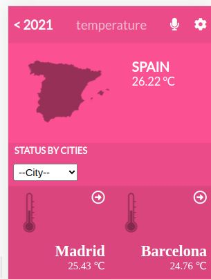

# Metrics webapp

А mobile web application to check a list of metrics (numeric values).

## Screenshot of the page

## Project Decription

A mobile web with a list of metrics that can be filtered by the country.

## Live Demo

[Live Demo Link](https://laughing-newton-9afe3e.netlify.app/#/)

## Demo Video

[Live Demo Link](https://www.loom.com/share/f9dc1626a06d4d2da555e00bd3f5bff9)

## Build With

- `React & Redux`

## Getting Started

To get a local copy up and running follow these simple example steps.

## Instructions

$ cd <folder>

$ git clone git@github.com:PolinaStamenova/wetrics-webapp.git

### Install

- Set up liveserver as an extension in your VS Code.
- If you dont have the live server extension, or are using another software just view directly in your browser.

- `npm install`

### Usage

- `npm start `

## Authors

👤 **Polina Stamenova**

- GitHub: [@githubhandle](https://github.com/PolinaStamenova)
- LinkedIn: [LinkedIn](https://www.linkedin.com/in/polina-stamenova-a60766112/)

## 🤝 Contributing

Contributions, issues, and feature requests are welcome!

Feel free to check the [issues page](https://github.com/PolinaStamenova/metrics-webapp/issues)

## Show your support

Give a ⭐️ if you like this project!

## Acknowledgments

- Microverse
- Creative Commons license of the design
